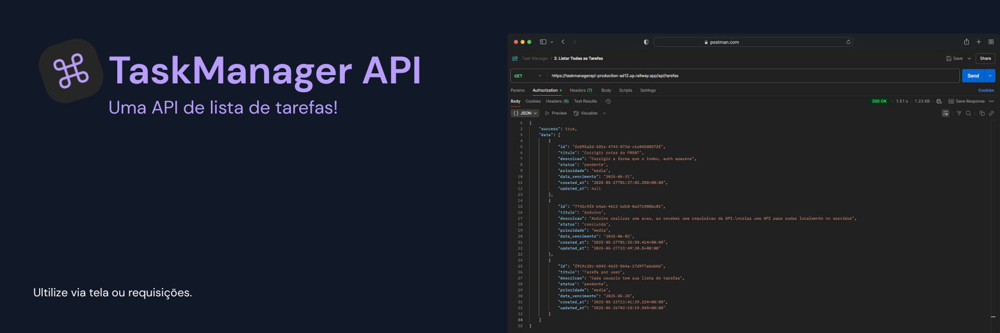

# TaskManagerAPI 📝
 </br>
API RESTful para gerenciamento de tarefas construída com Node.js e Supabase, incluindo sistema completo de autenticação.



## 🌐 URL da API em Produção

**Base URL**: `https://taskmanagerapi-production-ad12.up.railway.app/api/`

## Tecnologias

- Node.js
- Express
- Supabase (Banco de dados PostgreSQL + Auth)
- Joi (Validação)
- Dotenv (Variáveis de ambiente)
- Frontend HTML/CSS/JavaScript vanilla
- Railway (Deploy)

## Configuração do Backend

### 1. Clone o repositório

```bash
git clone https://github.com/lucaspanzera1/TaskManagerAPI.git
cd TaskManagerAPI
```

### 2. Instale as dependências

```bash
npm install
```

### 3. Configure o Supabase

1. Crie uma conta no [Supabase](https://supabase.com/)
2. Crie um novo projeto
3. No SQL Editor, crie as tabelas necessárias com o seguinte SQL:

```sql
-- Tabela de tarefas
CREATE TABLE tarefas (
  id UUID PRIMARY KEY DEFAULT uuid_generate_v4(),
  user_id UUID REFERENCES auth.users(id) ON DELETE CASCADE,
  titulo TEXT NOT NULL,
  descricao TEXT,
  status TEXT NOT NULL DEFAULT 'pendente',
  prioridade TEXT NOT NULL DEFAULT 'media',
  data_vencimento DATE,
  created_at TIMESTAMP WITH TIME ZONE DEFAULT CURRENT_TIMESTAMP,
  updated_at TIMESTAMP WITH TIME ZONE
);

-- Tabela de perfis de usuários
CREATE TABLE profiles (
  id UUID PRIMARY KEY REFERENCES auth.users(id) ON DELETE CASCADE,
  username TEXT UNIQUE NOT NULL,
  email TEXT UNIQUE NOT NULL,
  created_at TIMESTAMP WITH TIME ZONE DEFAULT CURRENT_TIMESTAMP
);

-- Índices para melhorar a performance
CREATE INDEX idx_tarefas_status ON tarefas(status);
CREATE INDEX idx_tarefas_prioridade ON tarefas(prioridade);
CREATE INDEX idx_tarefas_data_vencimento ON tarefas(data_vencimento);
CREATE INDEX idx_tarefas_user_id ON tarefas(user_id);
CREATE INDEX idx_profiles_username ON profiles(username);
CREATE INDEX idx_profiles_email ON profiles(email);
```

4. Configure as políticas RLS (Row Level Security):

```sql
-- Habilitar RLS nas tabelas
ALTER TABLE tarefas ENABLE ROW LEVEL SECURITY;
ALTER TABLE profiles ENABLE ROW LEVEL SECURITY;

-- Políticas para tarefas - usuário só pode ver suas próprias tarefas
CREATE POLICY "Usuários podem ver suas próprias tarefas" ON tarefas
  FOR SELECT USING (auth.uid() = user_id);

CREATE POLICY "Usuários podem inserir suas próprias tarefas" ON tarefas
  FOR INSERT WITH CHECK (auth.uid() = user_id);

CREATE POLICY "Usuários podem atualizar suas próprias tarefas" ON tarefas
  FOR UPDATE USING (auth.uid() = user_id);

CREATE POLICY "Usuários podem deletar suas próprias tarefas" ON tarefas
  FOR DELETE USING (auth.uid() = user_id);

-- Políticas para profiles
CREATE POLICY "Usuários podem ver seu próprio perfil" ON profiles
  FOR SELECT USING (auth.uid() = id);

CREATE POLICY "Usuários podem inserir seu próprio perfil" ON profiles
  FOR INSERT WITH CHECK (auth.uid() = id);
```

5. Copie a URL e a Chave da API do seu projeto Supabase

### 4. Configure as Variáveis de Ambiente

Renomeie o arquivo `.env.example` para `.env` e preencha as variáveis:

```
SUPABASE_URL=sua_url_do_supabase
SUPABASE_KEY=sua_chave_do_supabase
PORT=3000
```

### 5. Configure o CORS para o Frontend

Instale o pacote CORS se ainda não estiver instalado:

```bash
npm install cors
```

Adicione o middleware CORS ao seu servidor:

```javascript
// No arquivo server.js
const express = require('express');
const cors = require('cors');
const app = express();

// Habilitar CORS
app.use(cors());

// Resto do seu código...
```

### 6. Configuração de Autenticação no Supabase

Para ambiente de desenvolvimento, desative a confirmação de e-mail:

1. Acesse o painel do Supabase
2. Vá para `Authentication > Settings`
3. Desative "Enable email confirmations"

### 7. Inicie o servidor

```bash
# Modo desenvolvimento
npm run dev

# Modo produção
npm start
```

## 🛡️ Sistema de Autenticação

### Fluxo de Autenticação

O projeto utiliza Supabase Auth com username, email e password. Todas as rotas da API são protegidas por autenticação JWT.

#### 1. Cadastro de Usuário

- Cria um novo usuário no Supabase Auth usando `email` e `password`
- Cria um registro na tabela `profiles` associando `id`, `username` e `email`

#### 2. Login de Usuário

- Recebe `username` e `password`
- Busca o e-mail correspondente na tabela `profiles`
- Faz login usando `email + password` com Supabase Auth
- Retorna token JWT para autenticação nas próximas requisições

#### 3. Middleware de Autenticação

Todas as rotas de tarefas (`/api/tarefas`) são protegidas pelo middleware `authMiddleware`, que:
- Valida o token JWT no cabeçalho `Authorization: Bearer <token>`
- Retorna erro `401 Unauthorized` se o token for inválido
- Permite acesso apenas às tarefas do usuário autenticado

## 🖥️ Configuração do Frontend

### 1. Estrutura de Arquivos

Crie a seguinte estrutura de pastas dentro do projeto:

```
frontend/
├── css/
│   └── styles.css
├── js/
│   └── app.js
├── index.html     ← Página principal (protegida)
└── auth.html      ← Página de login/registro
```

### 2. Configuração da URL da API

No arquivo `frontend/js/app.js`, certifique-se de configurar a URL correta da API:

```javascript
// URL da API em produção
const API_BASE_URL = 'https://taskmanagerapi-production-ad12.up.railway.app/api';

// Para desenvolvimento local, use:
// const API_BASE_URL = 'http://localhost:3000/api';
```

### 3. Implementação dos Arquivos

#### auth.html
Nova página que contém duas abas:
- **Login**: realiza autenticação via Supabase com `username` e `senha`
- **Registro**: cria novo usuário na Supabase com `username`, `email` e `senha`

Ambas interagem com a API `/api/login` e `/api/signup`.

#### index.html
Arquivo HTML principal com a estrutura da interface do usuário. **Agora protegido por autenticação** com verificação automática de token no `<head>`:

```html
<script>
  const token = localStorage.getItem('token');
  if (!token) {
    window.location.href = 'auth.html';
  }
</script>
```

Se o usuário não estiver autenticado, ele é redirecionado imediatamente para `auth.html`.

#### styles.css
Estilos CSS para todos os componentes da interface, incluindo elementos de autenticação e a nova página `auth.html`.

#### app.js
Código JavaScript para gerenciar a comunicação com a API, autenticação e manipulação da interface. Inclui:
- Verificação automática de token antes de cada requisição
- Redirecionamento automático para `auth.html` em caso de token inválido (erro 401)
- Armazenamento seguro do token JWT no `localStorage`

### 4. Executando o Frontend

1. Certifique-se de que a API esteja rodando (produção: já está online)
2. Abra o arquivo `auth.html` no navegador (página inicial de login)
   - Para desenvolvimento, recomenda-se usar o Live Server do VSCode ou similar
3. Após autenticação bem-sucedida, o usuário será redirecionado automaticamente para `index.html`

**⚠️ Importante**: Agora `index.html` está protegido por autenticação. Usuários não autenticados serão automaticamente redirecionados para `auth.html`.

## 🔗 Funcionalidades do Frontend

### 1. Sistema de Autenticação Completo
- **Página `auth.html`** com duas abas:
  - **Login**: Formulário para entrar com username e password
  - **Registro**: Formulário para cadastro com username, email e password
- **Proteção automática**: `index.html` verifica autenticação antes de carregar
- **Gerenciamento de tokens**: Armazenamento automático no `localStorage`
- **Redirecionamento inteligente**: Usuários não autenticados são redirecionados para `auth.html`
- **Verificação contínua**: Token validado a cada requisição à API
- **Logout automático**: Redirecionamento em caso de token expirado (erro 401)

### 2. Visualização de Tarefas
- Lista todas as tarefas do usuário autenticado
- Exibe detalhes como título, descrição, status, prioridade e data de vencimento
- Cada tarefa é representada por um card com ações de editar e excluir

### 3. Filtragem por Status
- Permite filtrar tarefas por status (todos, pendente, em andamento, concluída)
- Os filtros são botões na parte superior da interface

### 4. Criação de Tarefas
- Formulário com campos para todos os atributos necessários
- Validação básica dos campos obrigatórios
- Feedback de sucesso/erro ao usuário

### 5. Edição de Tarefas
- Carrega os dados da tarefa selecionada no formulário
- Permite modificar qualquer atributo
- Atualiza a visualização após salvar as alterações

### 6. Exclusão de Tarefas
- Confirmação antes da exclusão
- Remove a tarefa da visualização após confirmação
- Feedback de sucesso/erro ao usuário

## 📡 Testando a API com Postman

### Configuração do Postman

1. Baixe e instale o [Postman](https://www.postman.com/downloads/)
2. Crie uma nova coleção (Collection) para organizar suas requisições
3. Adicione as requisições abaixo para testar cada funcionalidade da API

### Requisições para Teste

**⚠️ Importante**: Use a URL de produção: `https://taskmanagerapi-production-ad12.up.railway.app/api/`

#### 0. Verificar Status da API
- **Método**: GET
- **URL**: `https://taskmanagerapi-production-ad12.up.railway.app/`
- **Descrição**: Verifica se a API está online
- **Resposta esperada**:
  ```json
  {
    "message": "API de Gerenciamento de Tarefas",
    "versao": "1.0.0",
    "status": "online"
  }
  ```

#### 1. Cadastro de Usuário
- **Método**: POST
- **URL**: `https://taskmanagerapi-production-ad12.up.railway.app/api/signup`
- **Descrição**: Cadastrar um novo usuário
- **Headers**: 
  - `Content-Type: application/json`
- **Body** (raw JSON):
  ```json
  {
    "email": "usuario@email.com",
    "password": "123456",
    "username": "usuario123"
  }
  ```
- **Resposta esperada** (status 201):
  ```json
  {
    "success": true,
    "message": "Usuário cadastrado com sucesso",
    "user": {
      "id": "uuid...",
      "email": "usuario@email.com",
      "username": "usuario123"
    }
  }
  ```

#### 2. Login de Usuário
- **Método**: POST
- **URL**: `https://taskmanagerapi-production-ad12.up.railway.app/api/login`
- **Descrição**: Realizar login e obter token JWT
- **Headers**: 
  - `Content-Type: application/json`
- **Body** (raw JSON):
  ```json
  {
    "username": "usuario123",
    "password": "123456"
  }
  ```
- **Resposta esperada** (status 200):
  ```json
  {
    "token": "eyJhbGciOiJIUzI1NiIsInR...",
    "user": {
      "id": "uuid...",
      "email": "usuario@email.com",
      "username": "usuario123"
    }
  }
  ```

#### 3. Listar Todas as Tarefas
- **Método**: GET
- **URL**: `https://taskmanagerapi-production-ad12.up.railway.app/api/tarefas`
- **Descrição**: Retorna todas as tarefas do usuário autenticado
- **Headers**:
  - `Authorization: Bearer {token}`
- **Parâmetros opcionais**:
  - `status` (query): Filtrar por status (pendente, em_andamento, concluida)
  - Exemplo: `https://taskmanagerapi-production-ad12.up.railway.app/api/tarefas?status=pendente`

#### 4. Obter Tarefa por ID
- **Método**: GET
- **URL**: `https://taskmanagerapi-production-ad12.up.railway.app/api/tarefas/{id}`
- **Descrição**: Retorna uma tarefa específica pelo ID
- **Headers**:
  - `Authorization: Bearer {token}`
- **Exemplo**: `https://taskmanagerapi-production-ad12.up.railway.app/api/tarefas/550e8400-e29b-41d4-a716-446655440000`

#### 5. Criar Nova Tarefa
- **Método**: POST
- **URL**: `https://taskmanagerapi-production-ad12.up.railway.app/api/tarefas`
- **Headers**: 
  - `Content-Type: application/json`
  - `Authorization: Bearer {token}`
- **Body** (raw JSON):
  ```json
  {
    "titulo": "Comprar mantimentos",
    "descricao": "Ir ao supermercado e comprar itens da lista",
    "status": "pendente",
    "prioridade": "alta",
    "data_vencimento": "2023-12-31"
  }
  ```
- **Resposta esperada** (status 201):
  ```json
  {
    "success": true,
    "message": "Tarefa criada com sucesso",
    "data": {
      "id": "550e8400-e29b-41d4-a716-446655440000",
      "user_id": "uuid...",
      "titulo": "Comprar mantimentos",
      "descricao": "Ir ao supermercado e comprar itens da lista",
      "status": "pendente",
      "prioridade": "alta",
      "data_vencimento": "2023-12-31",
      "created_at": "2023-05-12T12:00:00.000Z"
    }
  }
  ```

#### 6. Atualizar Tarefa Existente
- **Método**: PUT
- **URL**: `https://taskmanagerapi-production-ad12.up.railway.app/api/tarefas/{id}`
- **Headers**: 
  - `Content-Type: application/json`
  - `Authorization: Bearer {token}`
- **Body** (raw JSON):
  ```json
  {
    "titulo": "Comprar mantimentos - atualizado",
    "descricao": "Ir ao supermercado e comprar itens atualizados da lista",
    "status": "em_andamento",
    "prioridade": "media",
    "data_vencimento": "2023-12-31"
  }
  ```
- **Resposta esperada** (status 200):
  ```json
  {
    "success": true,
    "message": "Tarefa atualizada com sucesso",
    "data": {
      "id": "550e8400-e29b-41d4-a716-446655440000",
      "user_id": "uuid...",
      "titulo": "Comprar mantimentos - atualizado",
      "descricao": "Ir ao supermercado e comprar itens atualizados da lista",
      "status": "em_andamento",
      "prioridade": "media",
      "data_vencimento": "2023-12-31",
      "created_at": "2023-05-12T12:00:00.000Z",
      "updated_at": "2023-05-12T14:30:00.000Z"
    }
  }
  ```

#### 7. Excluir Tarefa
- **Método**: DELETE
- **URL**: `https://taskmanagerapi-production-ad12.up.railway.app/api/tarefas/{id}`
- **Headers**:
  - `Authorization: Bearer {token}`
- **Descrição**: Remove uma tarefa específica pelo ID
- **Resposta esperada** (status 200):
  ```json
  {
    "success": true,
    "message": "Tarefa excluída com sucesso"
  }
  ```

### Fluxo de Teste Completo

1. Execute a requisição #0 para verificar se a API está online
2. Execute a requisição #1 para cadastrar um novo usuário
3. Execute a requisição #2 para fazer login e obter o token JWT
4. Use o token obtido nas próximas requisições (adicione no cabeçalho Authorization)
5. Execute a requisição #5 para criar uma nova tarefa (guarde o ID retornado)
6. Execute a requisição #3 para listar todas as tarefas e confirmar que sua tarefa foi criada
7. Execute a requisição #4 com o ID da tarefa criada para obter detalhes específicos
8. Execute a requisição #6 com o ID da tarefa para atualizá-la
9. Execute novamente a requisição #4 para verificar se as atualizações foram aplicadas
10. Execute a requisição #7 para excluir a tarefa
11. Execute a requisição #3 para confirmar que a tarefa foi removida

## 🧪 Fluxo de Teste do Frontend

### 1. Primeiro Acesso (Usuário Novo)
1. Abra o arquivo `frontend/auth.html` em um navegador
2. **Teste de Proteção**: Tente acessar `index.html` diretamente - você será redirecionado para `auth.html`

### 2. Teste de Autenticação
3. **Cadastro**:
   - Clique na aba "Registro"
   - Preencha username, email e password
   - Clique em "Cadastrar"
   - Verifique se o usuário é criado e redirecionado para login
   
4. **Login**:
   - Na aba "Login", insira username e password criados
   - Clique em "Entrar"
   - Verifique se o token é armazenado e o usuário é redirecionado para `index.html`

### 3. Teste de Funcionalidades de Tarefas
5. Agora em `index.html` (autenticado):
   - Crie uma nova tarefa preenchendo o formulário e clicando em "Salvar"
   - Verifique se a tarefa aparece na lista
   - Filtre as tarefas por status usando os botões de filtro
   - Edite uma tarefa clicando no botão "Editar", modificando os campos e salvando
   - Exclua uma tarefa clicando no botão "Excluir" e confirmando a ação

### 4. Teste de Segurança
6. **Teste de Token Expirado**:
   - Limpe o localStorage no navegador (F12 > Application > Local Storage)
   - Recarregue `index.html` - você será redirecionado para `auth.html`
   
7. **Teste de Logout** (se implementado):
   - Clique no botão de logout
   - Verifique se o token é removido e o usuário é redirecionado para `auth.html`

### 5. Fluxo Completo de Validação
- ✅ Usuários não autenticados não conseguem acessar `index.html`
- ✅ Login e registro funcionam com a API de autenticação
- ✅ O frontend está completamente integrado com autenticação Supabase
- ✅ Tokens são gerenciados automaticamente
- ✅ Redirecionamento automático funciona corretamente

## 💡 Possíveis Melhorias

### Backend
- Implementar refresh tokens para maior segurança
- Adicionar paginação para listar tarefas
- Implementar busca por texto nas tarefas
- Adicionar testes automatizados
- Implementar rate limiting para prevenir ataques
- Adicionar logs de auditoria
- Implementar recuperação de senha

### Frontend
- **Implementar funcionalidades de logout**: Adicionar botão de logout no `index.html`
- **Expiração automática de token**: Implementar verificação periódica de validade
- **Exibir informações do usuário**: Mostrar nome do usuário logado na interface
- Adicionar paginação para lidar com muitas tarefas
- Implementar sistema de recuperação de senha
- Adicionar campo de busca para encontrar tarefas específicas
- Permitir ordenação das tarefas por diferentes critérios
- Melhorar responsividade para dispositivos móveis
- Adicionar animações e transições para melhorar UX
- Implementar notificações push para tarefas próximas ao vencimento
- Adicionar modo escuro/claro

## 📁 Estrutura do Projeto

```
.
├── src/
│   ├── config/
│   │   └── supabase.js
│   ├── controllers/
│   │   ├── authController.js
│   │   └── tarefaController.js
│   ├── middlewares/
│   │   └── authMiddleware.js
│   ├── models/
│   │   ├── authModel.js
│   │   └── tarefaModel.js
│   ├── routes/
│   │   ├── authRoutes.js
│   │   ├── tarefaRoutes.js
│   │   └── index.js
│   ├── validations/
│   │   ├── authValidation.js
│   │   └── tarefaValidation.js
│   └── server.js
├── frontend/
│   ├── css/
│   │   └── styles.css
│   ├── js/
│   │   └── app.js
│   ├── auth.html
│   └── index.html
├── .env
├── .env.example
├── package.json
└── README.md
```

## 🔧 Solução de Problemas Comuns

### Problemas de Autenticação

#### Token expirado
- Tokens JWT têm prazo de validade. Implemente refresh tokens ou faça login novamente.

#### Usuário não confirmado
- Verifique se a confirmação de e-mail está desabilitada no desenvolvimento.
- Em produção, implemente fluxo de confirmação de e-mail.

#### Erro 401 Unauthorized
- Verifique se o token está sendo enviado corretamente no cabeçalho Authorization.
- Confirme se o formato é: `Bearer <token>`.

#### Problemas com Autenticação no Frontend

**Usuário não consegue acessar index.html**
- Verifique se existe um token válido no localStorage do navegador
- Confirme se o usuário fez login corretamente em `auth.html`
- Teste se a API de autenticação está respondendo corretamente

**Redirecionamento não funciona**
- Verifique se os arquivos `auth.html` e `index.html` estão no mesmo diretório
- Confirme se o JavaScript de proteção está no `<head>` de `index.html`
- Teste se o localStorage está habilitado no navegador

**Formulários de login/registro não funcionam**
- Verifique os logs do console para erros JavaScript
- Confirme se as URLs da API estão corretas no `app.js`
- Certifique-se de estar usando a URL de produção: `https://taskmanagerapi-production-ad12.up.railway.app/api`

#### CORS não configurado
Se você encontrar erros relacionados ao CORS ao tentar acessar a API pelo frontend, certifique-se de ter configurado corretamente o middleware CORS no backend.

#### API não responde
- Verifique se está usando a URL correta de produção
- Confirme se a porta configurada no frontend (`app.js`) corresponde à URL de produção
- Teste diretamente no navegador: `https://taskmanagerapi-production-ad12.up.railway.app/`

#### Formulário não envia
Verifique os logs do console do navegador para identificar possíveis erros. Certifique-se de que todos os campos obrigatórios estão preenchidos e que o usuário está autenticado.

#### Dados não são exibidos
Confirme se a URL da API está correta no arquivo `app.js`, se o token de autenticação está sendo enviado e se o formato dos dados retornados pela API corresponde ao esperado pelo frontend.

#### Problemas com RLS (Row Level Security)
Se as tarefas não estão sendo filtradas corretamente por usuário, verifique se as políticas RLS estão configuradas corretamente no Supabase.

## 🔒 Segurança

### Melhores Práticas Implementadas

- **Autenticação JWT**: Tokens seguros para autenticação de usuários
- **Row Level Security (RLS)**: Isolamento de dados por usuário no banco
- **Validação de entrada**: Joi para validação de dados
- **CORS configurado**: Controle de acesso entre origens
- **Senhas criptografadas**: Gerenciadas pelo Supabase Auth
- **Deploy seguro**: API hospedada no Railway com HTTPS

### Recomendações Adicionais

- Use HTTPS em produção (✅ Já implementado)
- Implemente rate limiting
- Configure logs de auditoria
- Mantenha dependências atualizadas
- Use variáveis de ambiente para dados sensíveis

## 🚀 Deploy

### Produção
A API está atualmente hospedada no Railway e pode ser acessada através da URL:
`https://taskmanagerapi-production-ad12.up.railway.app/api/`

### Desenvolvimento Local
Para rodar localmente, use:
```bash
npm run dev
```
E configure o frontend para usar `http://localhost:3000/api` como base URL.

## 📄 Licença

MIT

---

**Desenvolvido por**: Lucas Panzera  
**Repositório**: https://github.com/lucaspanzera1/TaskManagerAPI  
**API Produção**: https://taskmanagerapi-production-ad12.up.railway.app/api/